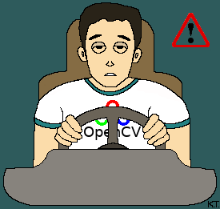

# AI
 A real-time Drowsiness Detection System using Python, OpenCV, and Dlib to monitor driver fatigue. The system tracks eye aspect ratio (EAR) and lips aspect ratio (LAR) to detect blinks and yawns, triggering an alert using Pygame audio warnings when drowsiness is detected.
# Drowsiness-Detection
Real time drowsiness detection (blinks or yawns) with OpenCV using facial landmarks.
* For a more detailed explanation of this project (more details and theory) read [*drowsiness_detection.pdf*](https://github.com/kostasthanos/Drowsiness-Detection/blob/main/drowsiness_detection.pdf). You are free to use this file, just leave a reference to it's url-link « https://github.com/kostasthanos/Drowsiness-Detection/blob/main/drowsiness_detection.pdf »

<p align="center">
  
</p>

## Main Idea
The main idea of this project is to detect drowsiness. In other words we are trying to detect eye blinks or yawns and decide about drowsiness. 
We will use **dlib** library for detecting faces and predicting the facial landmarks of a person.
```python
import dlib
# DLIB - Face Detector
detector = dlib.get_frontal_face_detector()
# DLIB - Predictor
predictor = dlib.shape_predictor('Models/shape_predictor_68_face_landmarks.dat')
```
Using the above detector and predictor, after converting the frame (video  capture) into grayscale, we detect faces on it. After that it's time to determine the facial landmarks.
```python
while True:
     _, frame = cap.read()
     h, w = frame.shape[: 2]    # Height and Width of frame

     gray = cv2.cvtColor(frame, cv2.COLOR_BGR2GRAY) # Grayscale
      
     faces = detector(gray, 0) # Detect faces in the gray frame

     # Loop through each face
     for face in faces:
          facial_landmarks = predictor(gray, face) # Determine facial landmarks
```
Below you can see a representation of the numbered facial landmarks. 
<p align="center">

</p>

## Eyes and Lips
Now that we have already detected the facial landmarks we can concentrate on the eyes and lips of a face in order to detect blinks or yawns respectively. 

## Eyes
As shown in the facial landmarks image we can define two lists with numbers corresponding to left and right eye.
```python
# Landmark indexes for eyes
left_eye = [36,37,38,39,40,41]
right_eye = [42,43,44,45,46,47]
```
<p align="center">

</p>

## Blink Detection
In order to build a function that will help us to determine if there is a blink or not we could use the **Eye Aspect Ratio** (E.A.R.) value as defined on the paper *Real-Time Eye Blink Detection using Facial Landmarks [Soukupova, Cech]*.

Let's enumerate the facial landmarks of a single eye with points P1 to P6 as shown below.
<p align="center">

</p>
We will calculate the two vertical distances between points P<sub>2</sub> - P<sub>6</sub> (dist1) and P<sub>3</sub> - P<sub>5</sub> (dist2), and the horizontal (largest) distance between points P<sub>1</sub> - P<sub>4</sub> (dist3). So the E.A.R. (from now on ear) is defined as :  

```python
ear = (dist1 + dist2)/2dist3
```


The above explanation and calculation is referring to only one eye. In order to use both eyes' *ear*, we can find the average eye aspect ratio from the two eyes (left and right).

### Is it blink or not ?
How to decide if there is a blink or not by the *ear* value ? We can set an *ear* threshold. This means that if the current value is less than the threshold then it's a blink. 

How to do this ? We can print a plot showing the *ear* value for each frame. Below there is a simple example that i made to define my *ear* threshold value.
<p align="center">

</p>

As a result I will set my *ear* threshold value to 0.3 at the beggining of our code.
```python
# E.A.R. threshold
ear_thresh = 0.3
```

## Lips
To find out if there is a yawn or not we will work exactly as before on the eyes section.  
First let's define a list with numbers corresponding to the lips part of a face as shown in the facial landmarks image.
```python
# Landmark indexes for lips
lips = [60,61,62,63,64,65,66,67]
```
<p align="center">

</p>

## Yawn Detection
We will define a function similar to the eyes' function, in order to calculate **Lips Aspect Ratio** (L.A.R.). Let's enumerate the facial landmarks corresponding to the ''interior'' lips with points L1 to L8.
<p align="center">

</p>
Now we can calculate the vertical distance between points L<sub>3</sub> and L<sub>7</sub> (dist1) and the horizontal distance between points L<sub>1</sub> and L<sub>5</sub> (dist2). So the L.A.R. (from now on lar) is defined as :

```python
lar = dist1/dist2
```

### Is it yawn or not ?
As in blink detection, we are going to set a *lar* threshold. Here it means that if the current value is greater than the threshold then it is a yawn. 
<p align="center">

</p>
This plot is way different than the one on ear threshold values per frame. Here there are 4 different time periods (frame periods) with different situations. These situations are :

1. Lips closed
2. Speaking
3. Yawning
4. Smiling

As a result I will set my *lar* threshold value to 0.5 at the beggining of our code.
```python
# L.A.R. threshold
lar_thresh = 0.5
```

## Drowsiness Detection
By combining eye aspect ration (*ear*) and lips aspect ratio (*lar*) values we can deside if there is drowsiness or not.
```python
if total_yawns > 2 or total_blinks > 3:
	cv2.putText(frame, "ALERT", (w-120, 160), font, 1.2, (0, 0, 255), 4)
```

### Notes
* To view the full code with extra comments see [*drowsiness_detection.py*](https://github.com/kostasthanos/Drowsiness-Detection/blob/main/drowsiness_detection.py).  
* For a more detailed explanation of this project see [*drowsiness_detection.pdf*](https://github.com/kostasthanos/Drowsiness-Detection/blob/main/drowsiness_detection.pdf).

## Author
* **Konstantinos Thanos**
